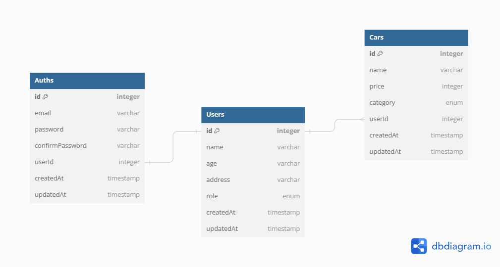

# Binar Academy Challenge Chapter 5

- sequelize-cli installed globally in this project. You can install usually npm install sequelize-cli
- do sequelize seeders to add user with role superadmin. the password is "1234567"

# Swagger Open API Documentation

Open http://localhost:4000/api-docs

# API endpoint requirements

# Auth API

##### GET /api/v1/auth

only superadmin can access this

##### POST /api/v1/auth/register

only member can access this

##### POST /api/v1/auth/login

superadmin, admin, and member can access this

##### GET /api/v1/auth/current-user

superadmin, admin, and member can access this

##### PUT /api/v1/auth/2

only superadmin and his own data can access this

##### DELETE /api/v1/auth/2

only superadmin and his own data can access this

# Users API

##### GET: /api/v1/users

only superadmin can access this

##### GET /api/v1/users/2

only superadmin can access this

##### POST /api/v1/users

only superadmin can access this

##### PUT /api/v1/users/2

only superadmin and his own data can access this

##### DELETE /api/v1/users/2

only superadmin and his own data can access this

# Cars API

##### GET /api/v1/cars

only superadmin and admin can access this

##### GET /api/v1/cars/1

only superadmin and admin can access this

##### POST /api/v1/cars

only superadmin and admin can access this

##### PUT /api/v1/cars/1

only superadmin and admin can access this

##### DELETE /api/v1/cars/1

only superadmin and admin can access this

# Database Diagram:

